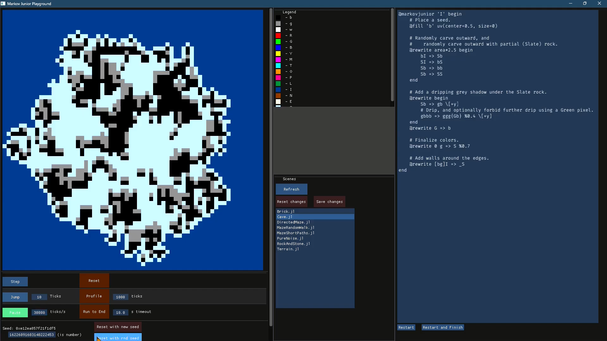

# MarkovJunior.jl

A Julia reimagining of [this awesome procedural generation algorithm](https://github.com/mxgmn/MarkovJunior/),
  able to generate in any number of dimensions.
It is planned for release as both a standalone executable to create scenes/images/video,
  and a C-like library that can be used anywhere.

````julia
# In the Julia REPL:
] add MarkovJunior
using MarkovJunior
markovjunior_run_tool()
````



[](https://youtu.be/mjBu7Omch1s)

*A YouTube video demo*

## Description

The released 0.1 version was a proof-of-concept, with a 2D renderer --
  totally functional and fun to play with.

The current 0.2 version has a rewritten DSL that is terse, highly extendible and broadly-featured.
Next on the docket is 3D rendering and many more Operations and Biases.
[You can find documentation on the new syntax here](docs/dsl.md).

Math and rendering is all built on top of my [B+ game framework](https://github.com/heyx3/B-plus).

The unit tests in *test/runtests.jl* are mostly focused on parsing,
  while correctness is checked by running sample scenes in the GUI.

## Development

On the main branch, this tool uses the main branch of B+ (and its sub-packages).
Clone BplusCore, BplusApp, BplusTools, and Bplus,
  then run the following from the Julia REPL:

````julia
# Add local B+ sub-packages to B+
] activate ../Bplus.jl
] dev ../BplusCore.jl ../BplusApp.jl ../BplusTools.jl
# Add local B+ to MarkovJunior
] activate .
] dev ../Bplus.jl
````

## Scenes

Different algorithm setups can be found in the *scenes/* folder.
They are commented with explanations of how they work.

A small handful of them are still not converted to the v0.2 syntax,
  so don't be alarmed if they fail to run!